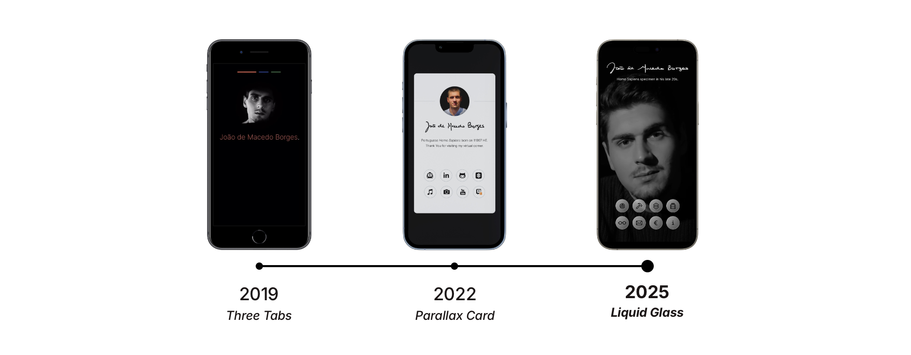

## 🔌 Service Status
You can always check if everything is up and running at [status.jbbmb.com](http://status.jbbmb.com).

## 🫶 Contributors
This project got a lot of love and support from [Mário Matias](https://www.linkedin.com/in/jmamatias), [Francisco Araújo](https://www.linkedin.com/in/franciscoeparaujo), [Miguel Martins](https://instagram.com/miguelmartinsmm), [Mariana Preto](https://www.linkedin.com/in/mariana-preto) and [Pedro Mouta](https://www.linkedin.com/in/pedro-mouta-52080124a).

## 👀 Privacy Policy
jbbmb.com itself does not use cookies or track You through browser storage mechanisms.

This website uses Google Analytics 4 to collect anonymized usage statistics. The information collected may include standard data such as your device type, browser version, screen resolution, approximate geographic location, and time spent on the website. This data is transmitted to and stored by Google on servers located outside the European Union.

The legal basis for processing this data is João's legitimate interest in understanding traffic patterns and improving user experience. No Personally Identifiable Information is intentionally collected, stored, or shared.

Under the General Data Protection Regulation, You have the right to request access to, or deletion of, any data associated with your session. Although this data is anonymized and not directly linked to individuals, requests will be honored to the fullest extent possible. To initiate such a request, please contact João directly via e-mail.

João reserves the right to update this policy at any time. Continued use of the website constitutes acceptance of any changes. Please review this policy periodically to stay informed.

## 📌 Copyright

All rights reserved unless otherwise stated. This website incorporates original work created by João de Macedo Borges and select open-source or public resources used in compliance with their respective licenses:
* *Inter Typeface*: designed by Rasmus Andersson, used under the MIT License.
* *SF Compact Iconography*: from the Apple Native CoreSVG 326 system, used for non-commercial purposes. All rights belong to Apple Incorporated.
* *Text Scramble Animation*: inspired by Justin Windle's public CodePen, used non-commercially.
* *Liquid Glass Effect*: adapted from publicly available code on Snipzy, used non-commercially.

Where applicable, code snippets and components may fall under Creative Commons Attribution 3.0 if not otherwise licensed.

All other content, source code, design, and assets not explicitly attributed are © João de Macedo Borges and may not be copied, reproduced, modified, or redistributed without prior permission.

This website is provided "as is" without any warranties. No liability is accepted for any loss or damages arising from its use.